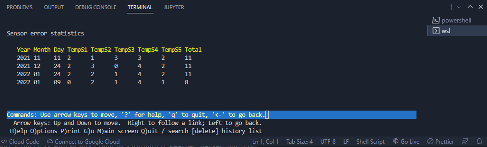

# DISCLAIMER  
**THIS IS SCHOOL HOMEWORK DO NOT REUSE THIS CODE**  

## weather data reader


## usage  
1. make a directory with weather data files formatted `weather_parser.out.txt`
```bash
mkdir <weatherdata_directory_name>
```  
2. copy `weather_parser.sh` and the weather data directory to a new directory and fix permissions
```bash
mkdir weather_stuff
cd weather_stuff 
cp ../<path_of_weatherdata_directory> ./<path_of_weatherdata_directory>
cp ../<path_of_weather_parser.sh> ./<path_of_weather_parser.bash>
chmod +rwx <path_of_weather_parser.sh>
```  
3. run/execute `weather_parser.bash`
```bash
./weather_parser.sh <weather_data_directory>
```  

4. open `sensorstats.html` (with browser or with lynx)  
``` bash
lynx sensorstats.html
```  
